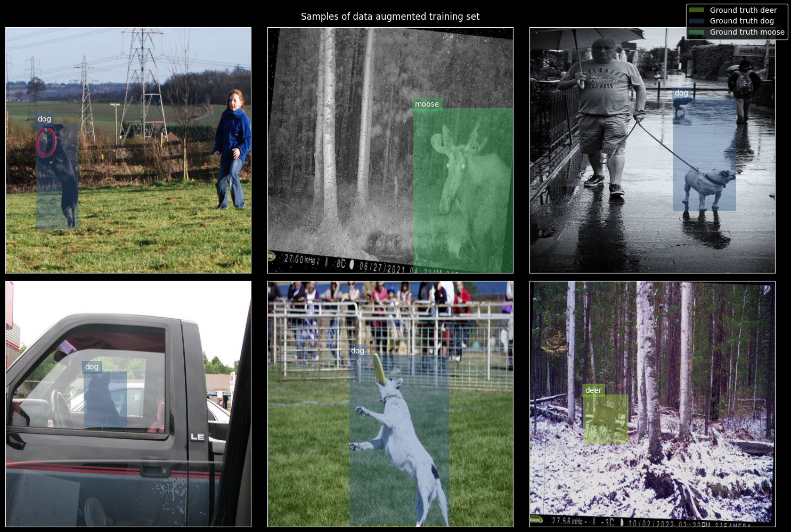
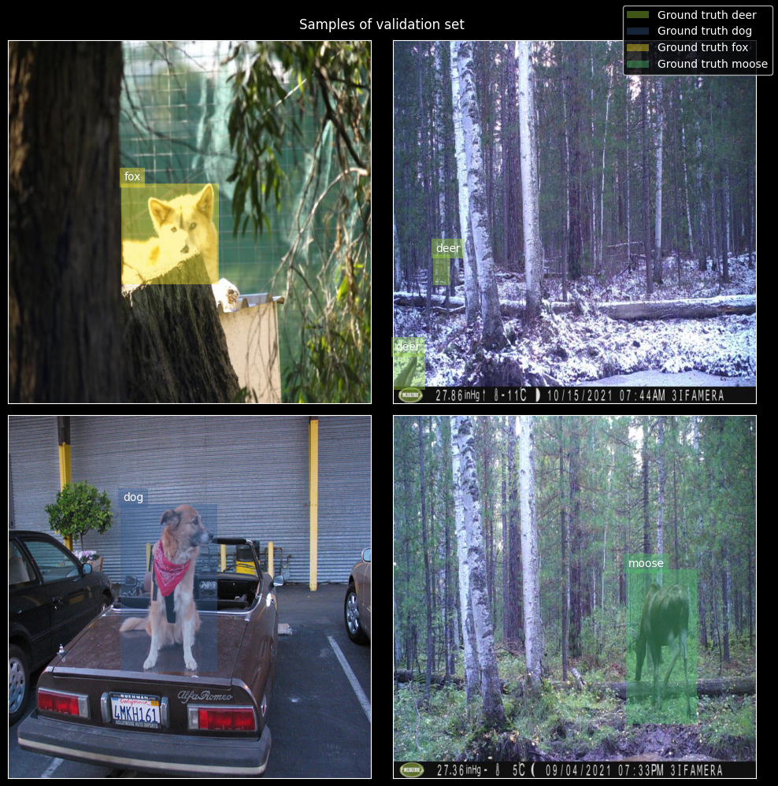
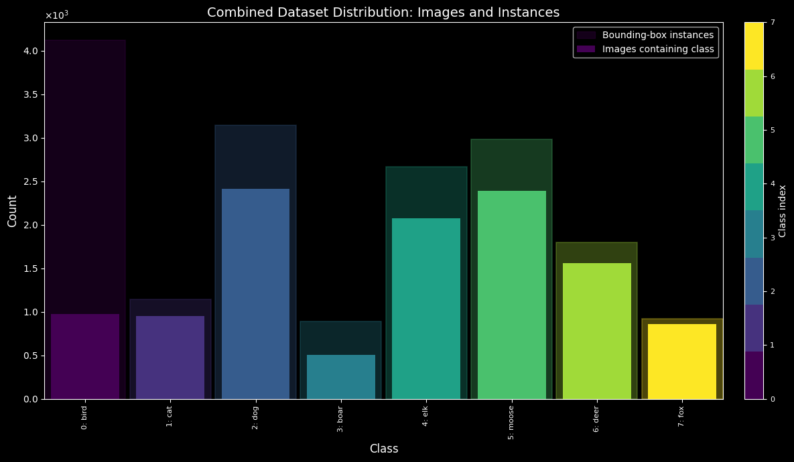
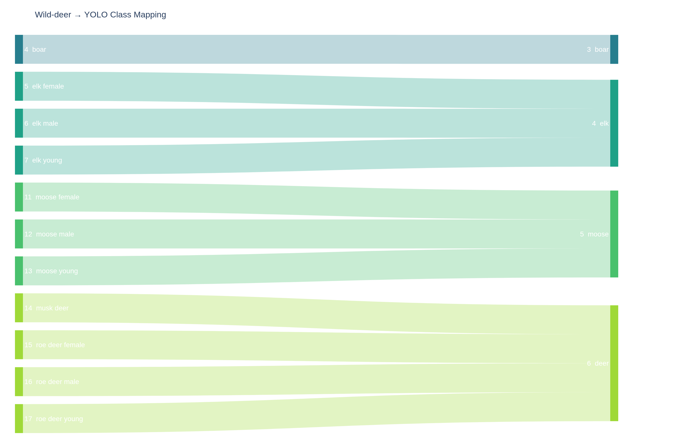

# Nordic animal detection

This repo is using a frozen pretrained YOLO26 model as the baseline for Nordic wildlife detection. The next step is to fine-tune on deer classes and related Nordic animal classes.

The current model is useful even when it makes imperfect predictions: false positives can still land on the right animal region, which helps us identify what the network already understands before the deer-specific training step, and to get some detections.

## Current frozen YOLO26 examples

## Nordic animal data starting point

These are some data distribution, samples and mappings as preparation for the next fine-tuning pass for Nordic-animal detection.

