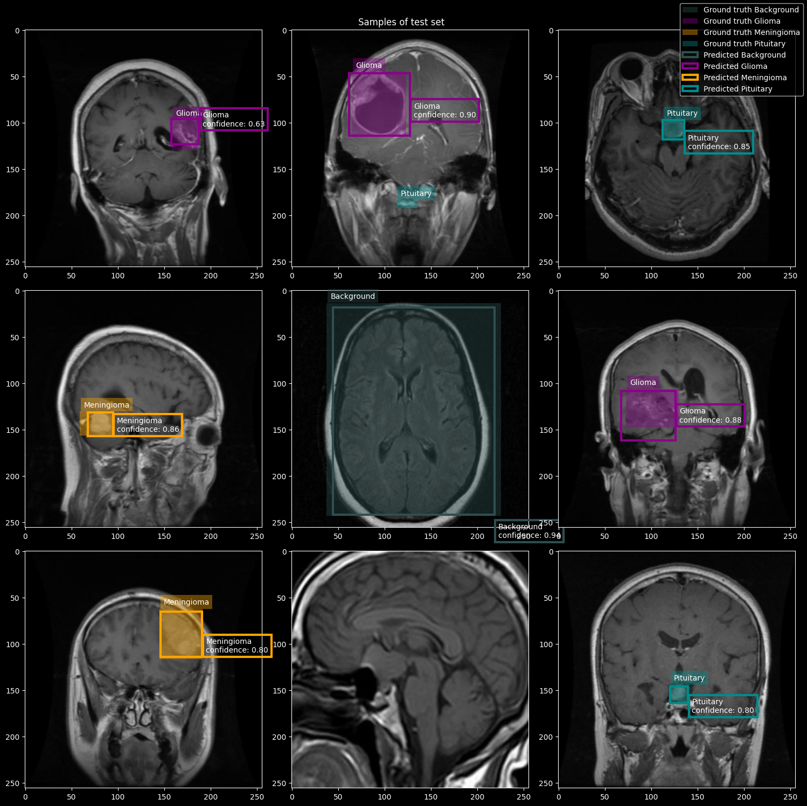
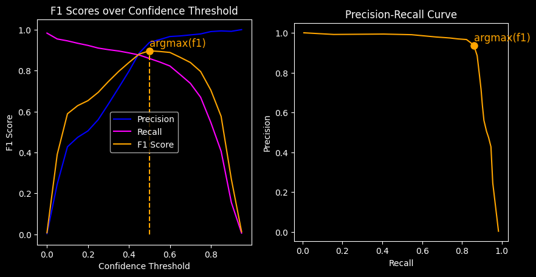
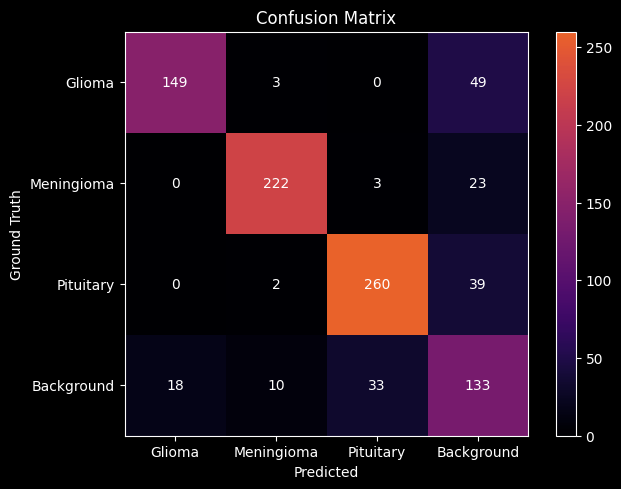

# MRI brain tumor detection

Localizing and classifying brain tumours with bounding boxes on brain MRI data set.
Documentation and implementation in [mri-detection.ipynb](mri-detection.ipynb)

## Motivation
Model, data augmentation and loss is inspired by [Ultralytics Yolo5](https://docs.ultralytics.com/yolov5/), which also is evaluated for comparison.
By replicating the concepts of the original model, as opposed to exactly reproducing it, the implementation and performance differ. 

The intention behind this repo, however, is to get an better understanding of the object detection task by implementing a solution from scratch (using PyTorch etc.), why more focus on explainable code and visualizations rather than obtaining the exact same performance.

## Sample Results
Some samples of predictions with ground truth

using confidence threshold that maximizes scores

resulting in prediction vs ground truth distribution summarized in confusion matrix visualization

