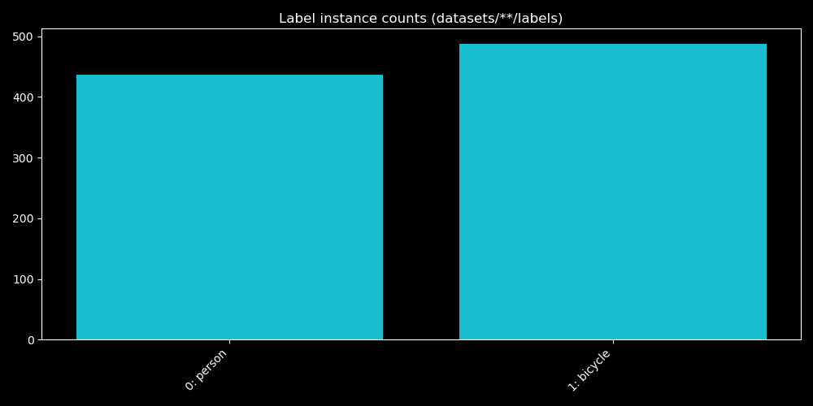

# MRI brain tumor detection

Localizing and classifying brain tumours with bounding boxes on brain MRI data set.
Documentation and implementation in [mri-detection.ipynb](mri-detection.ipynb)

## Motivation
Model, data augmentation and loss is inspired by [Ultralytics Yolo5](https://docs.ultralytics.com/yolov5/), which also is evaluated for comparison.
By replicating the concepts of the original model, as opposed to exactly reproducing it, the implementation and performance differ. 

The intention behind this repo, however, is to get an better understanding of the object detection task by implementing a solution from scratch (using PyTorch etc.), why more focus on explainable code and visualizations rather than obtaining the exact same performance.

## Local animal-detection showcase
The repo also contains a lightweight local showcase for the custom YOLO checkpoint `yolo_nordic_animals.pt`, which was trained in the Kaggle workflow on a combined COCO subset and wildlife classes. The quick validation pass is kept here so the project can be reviewed locally without publishing the full Kaggle notebook yet.

The script in `scripts/infer_showcase.py` runs a few predictions on sample images in `nordic_animals/` and writes annotated outputs plus a label-distribution chart to `docs/infer_outputs/`.

### Example inference images

### Combined dataset distribution

This summary is a lightweight view of the current labels available in the repo and will be updated as the full Kaggle preprocessing pipeline is finalized and published.

## Sample Results
Some samples of predictions with ground truth

using confidence threshold that maximizes scores

resulting in prediction vs ground truth distribution summarized in confusion matrix visualization

