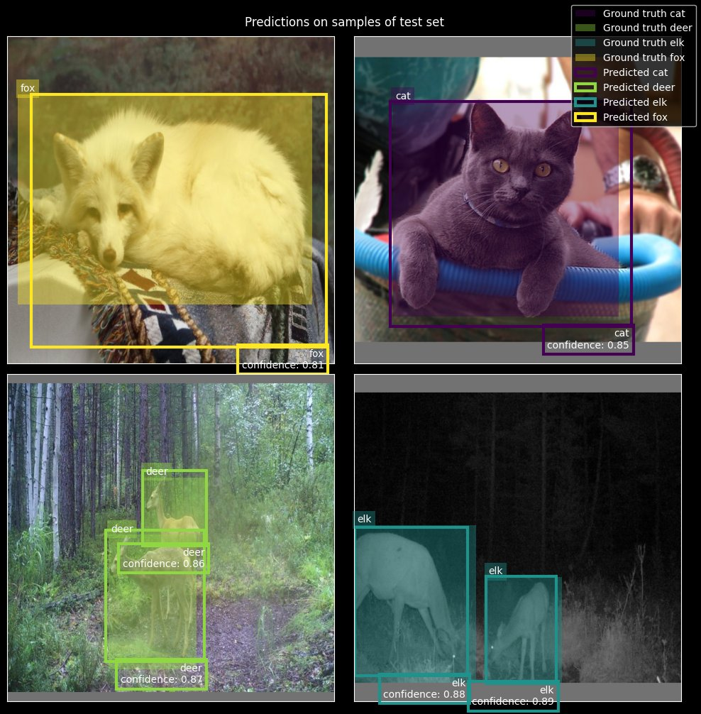
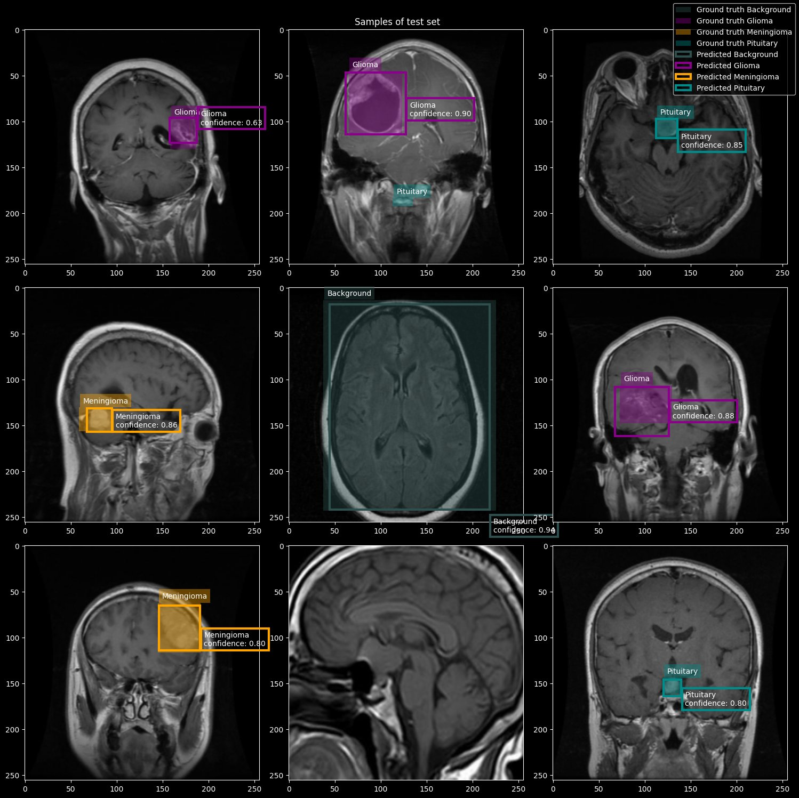

# Object detection

Two object detection projects, each documented as a Kaggle notebook.

| | Nordic animal detection | MRI brain tumor detection |
|---|---|---|
| Goal | Tell which animal passes a camera on a Raspberry Pi 3 | Understand object detection by building a detector from scratch |
| Model | YOLO26n, fine-tuned | Own model inspired by YOLOv5, compared with Ultralytics YOLOv5 |
| Test F1 score | 0.81 | 0.88 (own model), 0.89 (YOLOv5) |
| Notebook | [nordic-animal-detection.ipynb](nordic-animal-detection.ipynb) | [mri-detection.ipynb](mri-detection.ipynb) |
| Summary | [docs/nordic-animal-detection.md](docs/nordic-animal-detection.md) | [docs/mri-detection.md](docs/mri-detection.md) |
| Kaggle | [Open in Kaggle](https://www.kaggle.com/code/johndahlberg/object-detection) | [Open in Kaggle](https://www.kaggle.com/code/johndahlberg/mri-detection) |

## Nordic animal detection

A Raspberry Pi 3 with a camera, placed in the Nordic countryside, should tell which animal passes by. The Pi runs the model on its CPU, so the detector has to be the smallest YOLO model, YOLO26n at 640 px. It is fine-tuned to find boar, elk, moose, deer, fox, cat and dog.

Most of the work was in the data: a camera info stripe that would have let the model cheat, a dataset without test images, and bird boxes too small for a nano model to see. On the test set the model reaches a precision of 0.88 and a recall of 0.75. It tells the wild animals apart and sometimes mixes up cats and dogs.

Read the full summary in [docs/nordic-animal-detection.md](docs/nordic-animal-detection.md).

## MRI brain tumor detection

Localizing and classifying brain tumours with bounding boxes on a brain MRI data set. The model, data augmentation and loss are written from scratch in PyTorch, inspired by Ultralytics YOLOv5, to get a better understanding of the object detection task. The focus is on explainable code and visualizations more than on matching the original's performance.

The own model reaches a precision of 0.90 and a recall of 0.85 on the test set. An Ultralytics YOLOv5 model trained on the same data for comparison reaches 0.88 and 0.90.

Read the full summary in [docs/mri-detection.md](docs/mri-detection.md).
