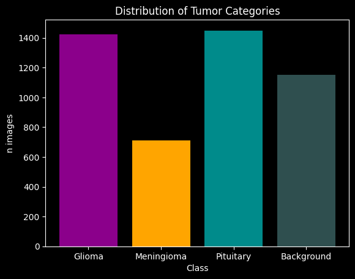
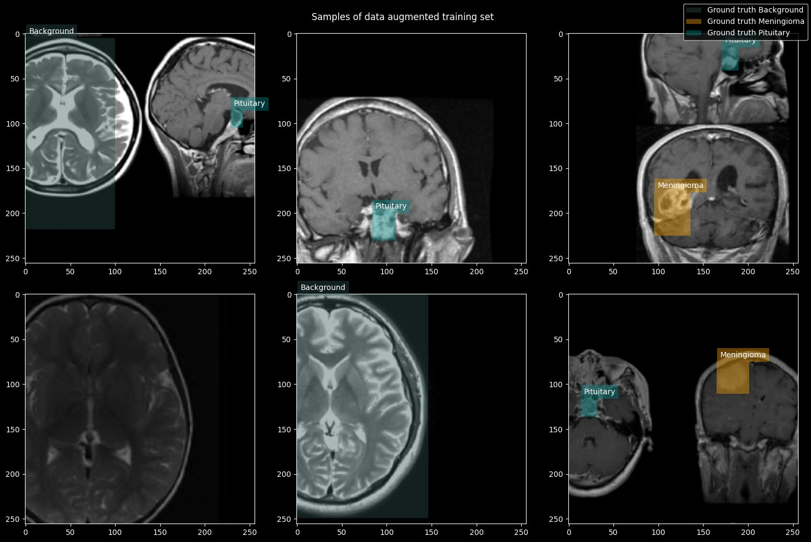
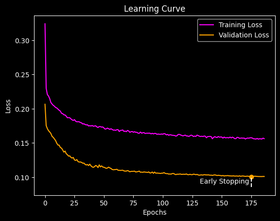
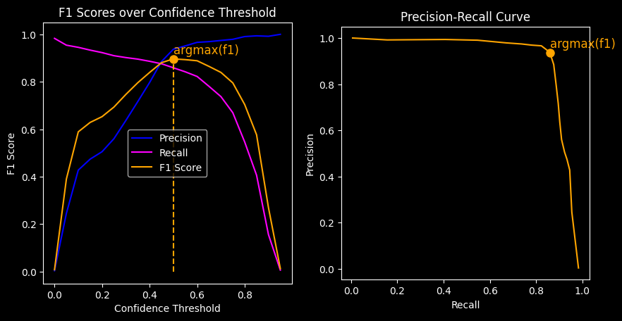
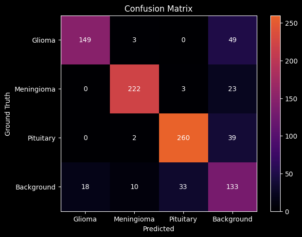
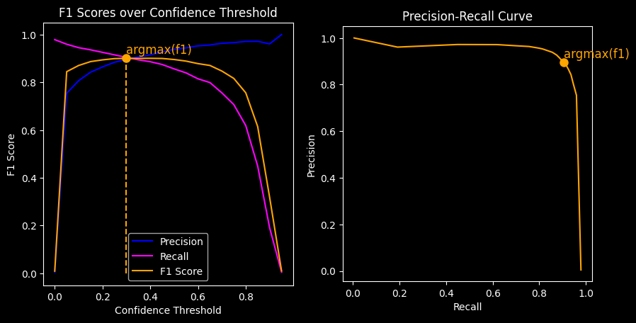
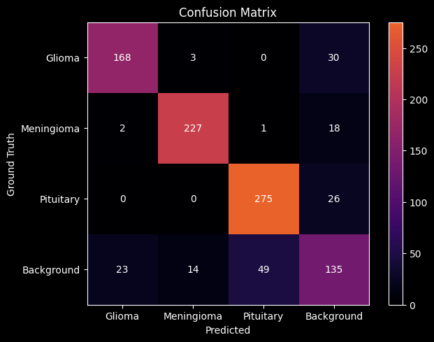
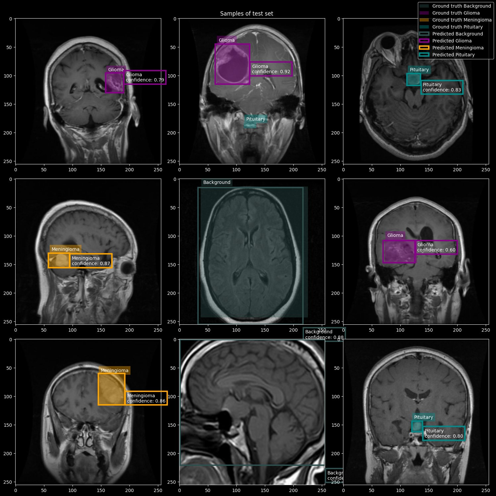

# MRI brain tumor detection

Summary of [mri-detection.ipynb](../mri-detection.ipynb). The notebook also runs on Kaggle: [Open in Kaggle](https://www.kaggle.com/code/johndahlberg/mri-detection).

## Goal

Localizing and classifying brain tumours with bounding boxes on a brain MRI data set.

The model, data augmentation and loss are inspired by [Ultralytics YOLOv5](https://docs.ultralytics.com/yolov5/), which is also evaluated for comparison. The concepts of the original model are replicated, not reproduced exactly, so implementation and performance differ. The intention is to get a better understanding of the object detection task by implementing a solution from scratch in PyTorch. The focus is therefore on explainable code and visualizations more than on obtaining the same performance.

## Data

The data set is [MRI for brain tumor with bounding boxes](https://www.kaggle.com/datasets/ahmedsorour1/mri-for-brain-tumor-with-bounding-boxes) with the tumor classes glioma, meningioma and pituitary, plus images without a tumor. It is split into 3674 training, 787 validation and 788 test images.

A dataset class loads the images and boxes and applies data augmentation to the training set. Images are resized to 256 px.

## Model and training

* **Anchors.** The anchor box sizes are found with k-means clustering of the boxes in the unaugmented training set.
* **Model.** Written from the building blocks of YOLOv5: a CSP-Darknet backbone, a path aggregation network and a detection head, with 15.8 million parameters.
* **Optimizer.** SGD with a learning rate schedule in two phases, a warm up that increases the learning rate linearly and a cool down that anneals it with a cosine function.
* **Stopping.** Training stops early when the validation loss has not improved for 10 epochs. The best model is from epoch 175 of 200.

## Results

The confidence threshold with the highest F1 score is chosen, and the model is evaluated on the test set.

| Model | Parameters | Confidence threshold | Precision | Recall | F1 score |
|---|---|---|---|---|---|
| Own model | 15.8 million | 0.50 | 0.90 | 0.85 | 0.88 |
| Ultralytics YOLOv5 (`yolov5mu`) | 25.1 million | 0.30 | 0.88 | 0.90 | 0.89 |

### Own model

The three tumor classes are rarely mistaken for each other. Most errors are tumors that are not found, or detections where there is no tumor.

### Ultralytics YOLOv5 on the same data

## Next steps

* Improve hyper parameter search for better performance
* Pre-train model on other dataset
* Unit test code
