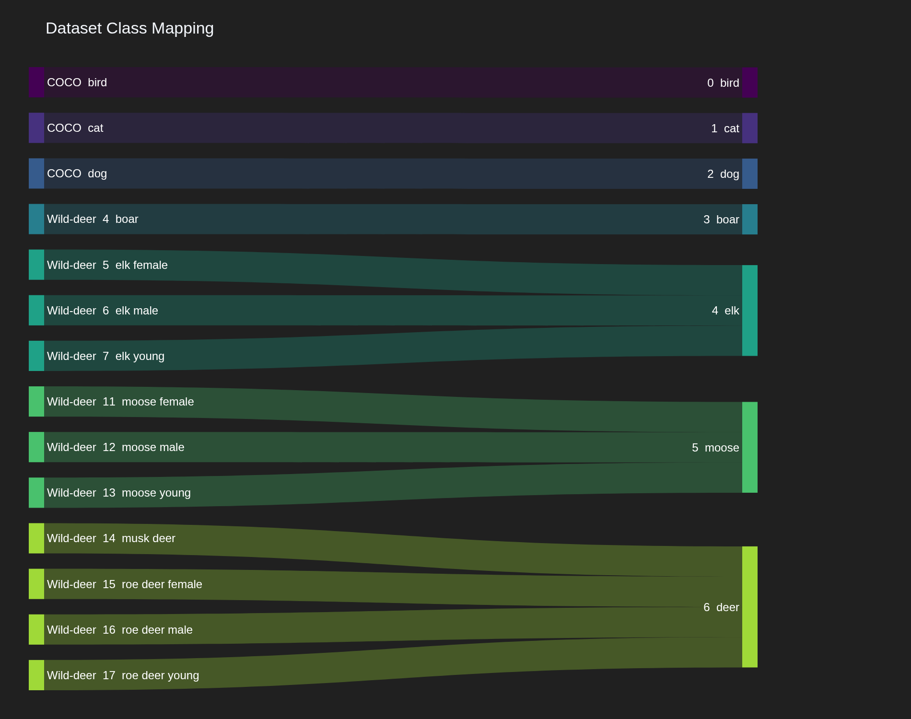
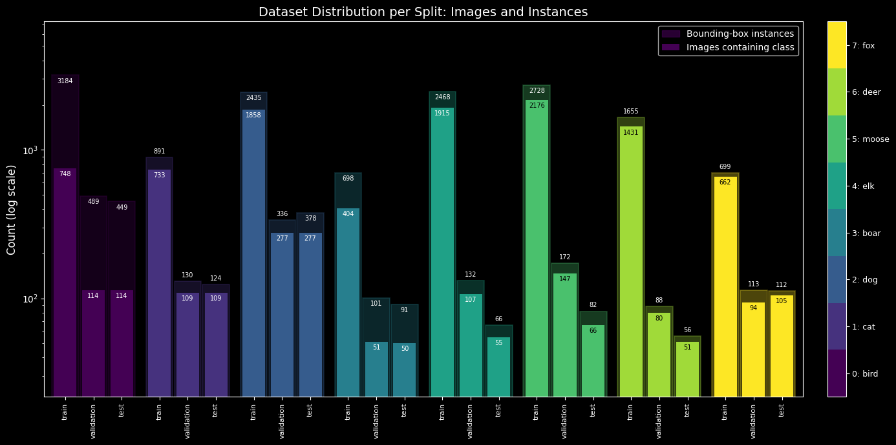
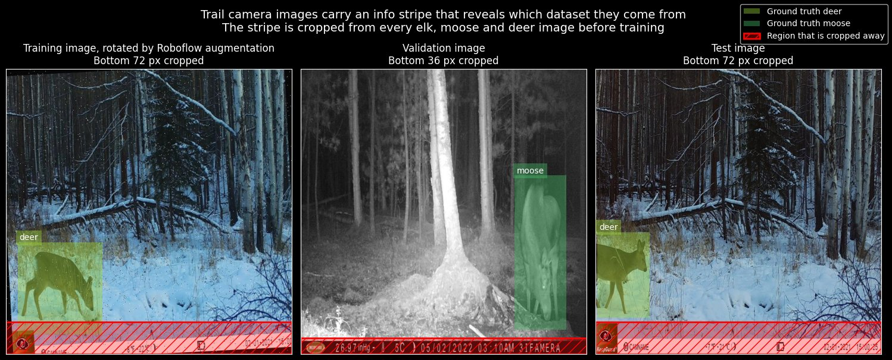
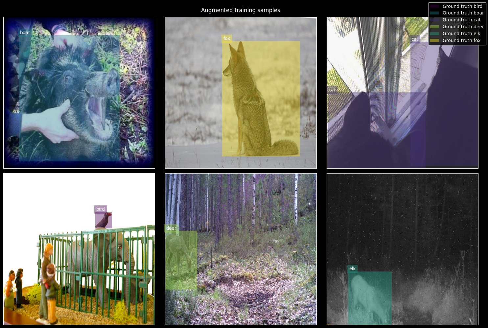
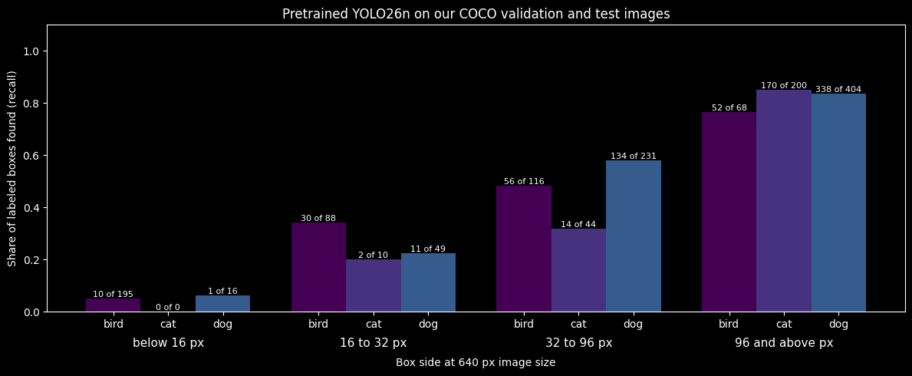
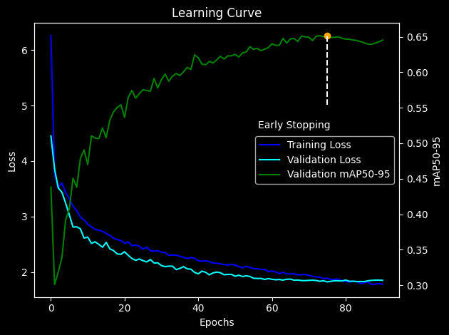
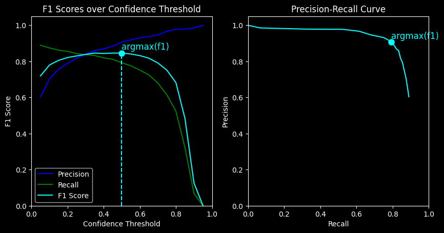
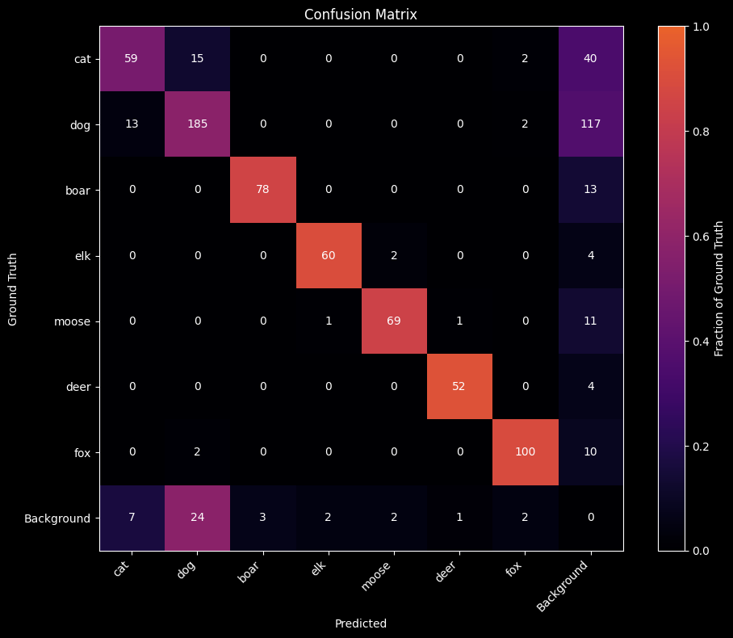

# Nordic animal detection

Summary of [nordic-animal-detection.ipynb](../nordic-animal-detection.ipynb). The notebook also runs on Kaggle: [Open in Kaggle](https://www.kaggle.com/code/johndahlberg/object-detection).

## Goal

A Raspberry Pi 3 with a camera, placed in the Nordic countryside, should tell which animal passes by.

* **The constraint.** The Pi runs the model on its CPU, where even the smallest YOLO model needs several seconds per image. So the model has to be YOLO26n at 640 px. A larger model or a higher resolution is not an option.
* **The classes.** The wild animals boar, elk, moose, deer and fox, and the pets cat and dog. Bird starts out as a class, is evaluated, and is dropped along the way.

## Data

The data combines a subset of COCO (bird, cat, dog) with wildlife datasets from Roboflow. The elk, moose and deer images come from trail cameras. The boar and fox images are ordinary daytime photos.

COCO and the boar dataset are split by us into 80% train, 10% validation and 10% test. The elk, moose, deer and fox datasets keep their Roboflow split, because Roboflow adds augmented copies to the training images only. Shuffling them again would put copies of the same photo in both train and test.

## Problems found in the data

**The camera stripe gives away the answer.** The trail cameras stamp a stripe with a logo at the bottom of every image. No other class has it, so a model can learn "stripe means elk, moose or deer" instead of looking at the animal. The bottom 36 px of these images is cropped, or 72 px for cameras with a taller logo. Some rotated training copies keep a tilted sliver of the stripe. Validation and test images end up clean, so that sliver cannot improve the scores.

**Samples after the crop.**

**COCO boxes the model cannot see.** Before training, the pretrained YOLO26n was run on our COCO validation and test images. How many labeled animals it finds depends strongly on box size. Of the bird boxes below 16 px it finds 10 of 195. Of those at 96 px and above it finds 52 of 68. This model has already seen all of COCO, so more data would not change that.

COCO images with a crowd box (133) or with any box below 32 px (744) are therefore removed. Whole images are removed, not single labels, so that no visible animal is left unlabeled.

**Bird is dropped.** After that pruning only 273 training, 44 validation and 44 test images with birds are left, and a nano model at 640 px would only find large, clearly visible birds. Bird labels are removed (553 boxes), together with the 347 images that only contained birds.

## Training

YOLO26n pretrained on COCO is fine-tuned with all layers trainable, since trail camera images, many of them infrared night shots, look different from COCO photos. Augmentation uses mosaic, horizontal flips, scaling, translation and mild color changes. Training stops early when the validation score has not improved for 15 epochs.

The run stopped after about 90 epochs. The weights from around epoch 75 are kept, where the validation mAP50-95 peaks at about 0.65.

## Results

The confidence threshold with the highest F1 score on the validation set is 0.50. On the test set it gives:

| Precision | Recall | F1 score |
|---|---|---|
| 0.88 | 0.75 | 0.81 |

* **The wild animals are told apart.** Boar, elk, moose, deer and fox are almost never mistaken for each other.
* **Cats and dogs get mixed up.** 15 cats are predicted as dogs and 13 dogs as cats. That is acceptable for this use, since both are pets.
* **Cats and dogs are also missed most often.** 40 of 116 cats and 117 of 317 dogs are not found at all.

## Limits

* The model has not run on the Raspberry Pi. Its speed there is not measured.
* The trail camera images in train and test come from the same camera locations. The scores for elk, moose and deer tell how well the model works at locations it has seen, not at a new place.
* The boar and fox images are ordinary daytime photos, while the detector will look through a trail camera.

## Next steps

* Run the model on the Raspberry Pi 3 and measure the time per image
* Test on trail camera images from locations that are not in the training data
* Collect trail camera images of boar and fox
* Improve hyper parameter search for better performance
